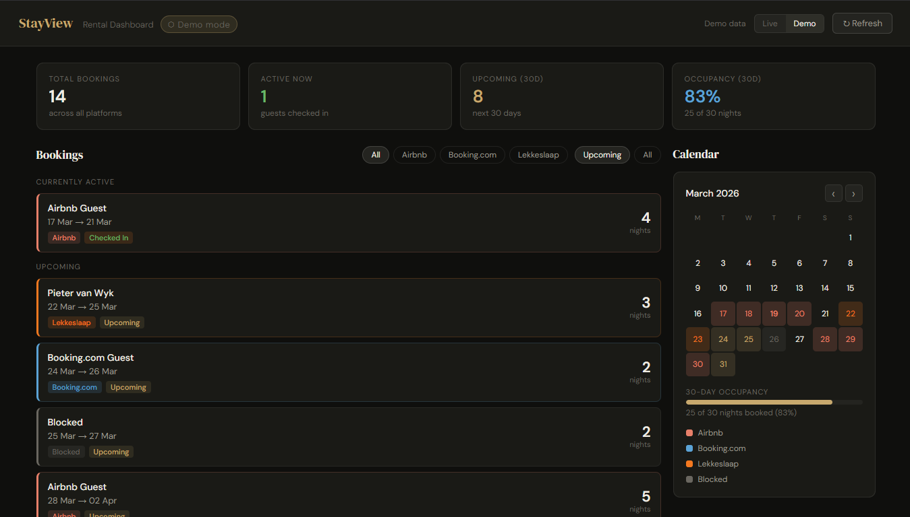

# StayView — Rental Dashboard

A self-hosted dashboard that aggregates bookings from **Airbnb**, **Booking.com**, and **Lekkeslaap** into one place. Built with vanilla JS and a lightweight Node.js proxy server — no framework, no database, no dependencies.

[](https://YOUR_APP.onrender.com)


## Live Demo

👉 [your-app.onrender.com](https://YOUR_APP.onrender.com) — click **Demo** in the header to see sample data without any credentials.

## Features

- Live booking feed from all 3 platforms via iCal
- Calendar view with colour-coded bookings per platform
- 30-day occupancy stats
- Filters by platform and upcoming/all view
- **Demo mode** — toggle to see sample data without needing live credentials
- Self-hosted on a Raspberry Pi or any Node.js server

## Getting Started

### 1. Clone the repo

```bash
git clone https://github.com/YOUR_USERNAME/stayview.git
cd stayview
```

### 2. Configure your iCal URLs

Copy the example env file and fill in your private iCal URLs:

```bash
cp .env.example .env
```

Edit `.env`:

```
ICAL_AIRBNB=https://www.airbnb.com/calendar/ical/YOUR_ID.ics?t=YOUR_TOKEN
ICAL_BOOKING=https://ical.booking.com/v1/export?t=YOUR_TOKEN
ICAL_LEKKESLAAP=https://www.lekkeslaap.co.za/suppliers/icalendar.ics?t=YOUR_TOKEN
```

> Your `.env` file is listed in `.gitignore` and will never be committed.

### 3. Run

```bash
node server.js
```

Open `http://localhost:3456` in your browser.

## Deploying to a Raspberry Pi

```bash
# Copy files to your Pi, then:
sudo cp stayview.service /etc/systemd/system/
sudo systemctl daemon-reload
sudo systemctl enable stayview
sudo systemctl start stayview
```

## Deploying to Render (live URL)

[](https://render.com/deploy)

1. Go to [render.com](https://render.com) and sign in with GitHub
2. **New → Web Service → Connect** your `stayview` repo
3. Settings:
   - **Runtime**: Node
   - **Build command**: *(leave empty)*
   - **Start command**: `node server.js`
4. Under **Environment**, add your 3 variables:
   - `ICAL_AIRBNB`
   - `ICAL_BOOKING`
   - `ICAL_LEKKESLAAP`
5. Click **Deploy** — you'll get a URL like `https://stayview.onrender.com`
6. Update the demo link and badge at the top of this README with your URL

## Where to find your iCal URLs

| Platform | Location |
|---|---|
| **Airbnb** | Calendar → Availability settings → Export calendar |
| **Booking.com** | Property → Calendar → Export calendar |
| **Lekkeslaap** | Supplier dashboard → Calendar → iCal export |

## Stack

- **Frontend**: Vanilla HTML/CSS/JS, DM Sans + DM Serif Display fonts
- **Backend**: Node.js built-in `http` / `https` modules — zero npm dependencies
- **Hosting**: Raspberry Pi with systemd, or any Node.js host