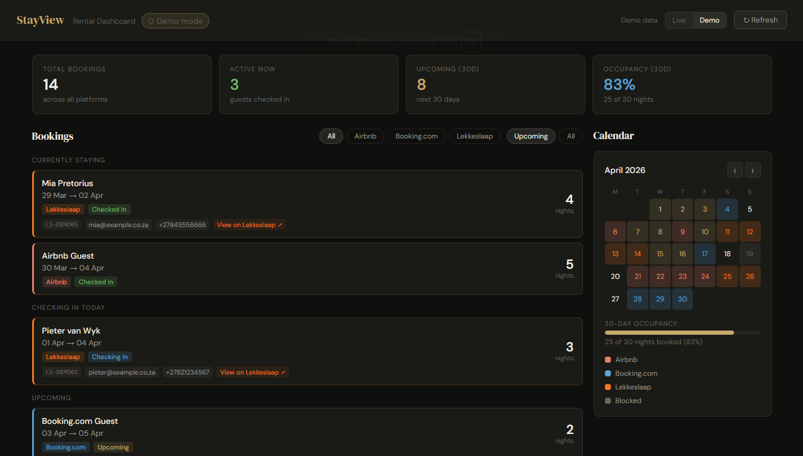

# StayView — Rental Dashboard

A self-hosted dashboard that aggregates bookings from **Airbnb**, **Booking.com** and **Lekkeslaap** into one place. Accept direct bookings commission-free. Built with vanilla JS and a lightweight Node.js server — no framework, no database, no npm dependencies.

[](https://stayview.onrender.com)
[](LICENSE)
[](https://github.com/louisnelza/stayview/releases)



## Live Demo

👉 [stayview.onrender.com](https://stayview.onrender.com) — click **Demo** in the header to see sample data without any credentials.

## Features

- **Multi-platform** — Airbnb, Booking.com and Lekkeslaap iCal feeds in one view
- **Multi-property** — manage multiple rentals from one dashboard with a property switcher
- **Direct booking engine** — guest-facing `/book` page so guests can book without platform commissions
- **Manual booking capture** — add walk-in or phone bookings directly to the dashboard
- **Calendar view** — colour-coded by platform with turnaround day indicators
- **Granular booking status** — Checking In / Checked In / Checking Out / Upcoming / Past
- **Turnaround day indicator** — flags same-day checkout + checkin between bookings
- **30-day occupancy stats** — nights booked, active guests, upcoming bookings
- **Platform filters** — only shows filters for platforms you have configured
- **Auto-refresh** — server-side polling keeps data current without manual refresh
- **Platform downtime resilience** — cached iCal data served when a platform is temporarily unavailable
- **Lekkeslaap guest details** — reference number, email, cell and supplier link on booking cards
- **Provisional booking detection** — flags Lekkeslaap bookings awaiting confirmation
- **Demo mode** — realistic sample data, works without any credentials
- **Self-hosted** — runs on a Raspberry Pi, no cloud subscription required

## Getting Started

### 1. Clone the repo

```bash
git clone https://github.com/louisnelza/stayview.git
cd stayview
```

### 2. Configure your iCal URLs

Copy the example env file and fill in your iCal URLs:

```bash
cp .env.example .env
```

Edit `.env` — multi-property format (recommended):

```
PROPERTY_1_NAME=Scottburgh Beach House
PROPERTY_1_LOCATION=Scottburgh, KwaZulu-Natal
PROPERTY_1_AIRBNB=https://www.airbnb.com/calendar/ical/YOUR_ID.ics?t=YOUR_TOKEN
PROPERTY_1_BOOKING=https://ical.booking.com/v1/export?t=YOUR_TOKEN
PROPERTY_1_LEKKESLAAP=https://www.lekkeslaap.co.za/suppliers/icalendar.ics?t=YOUR_TOKEN
PROPERTY_1_NIGHTLY_RATE=1200
PROPERTY_1_CURRENCY=ZAR
PROPERTY_1_MIN_NIGHTS=2
PROPERTY_1_MAX_GUESTS=8

# Add a second property by uncommenting and filling in:
# PROPERTY_2_NAME=Durban City Apartment
# PROPERTY_2_AIRBNB=
# PROPERTY_2_BOOKING=
# PROPERTY_2_LEKKESLAAP=

POLL_INTERVAL_MINUTES=120
```

Legacy single-property format still works too — see `.env.example` for details.

> Your `.env` file is listed in `.gitignore` and will never be committed.

### 3. Run

```bash
node server.js
```

Open `http://localhost:3456` in your browser.

## Direct Booking Engine

Guests can book directly at `http://your-server:3456/book` without going through a platform.

To manually capture a walk-in or phone booking, add an entry to `bookings.json` in the same folder as `server.js`:

```json
[
  {
    "uid": "direct-1234567890",
    "source": "direct",
    "name": "Guest Name",
    "email": "guest@email.com",
    "phone": "+27821234567",
    "guests": 2,
    "checkin": "2026-08-01",
    "checkout": "2026-08-05",
    "nights": 4,
    "total": 4800,
    "currency": "ZAR",
    "status": "confirmed",
    "created": "2026-07-17T08:00:00.000Z"
  }
]
```

Click **↻ Refresh** in the dashboard to load the new booking. Direct bookings appear in purple and can be deleted from the dashboard with the ✕ button.

## Where to find your iCal URLs

| Platform | Location |
|---|---|
| **Airbnb** | Calendar → Availability settings → Export calendar |
| **Booking.com** | Property → Calendar → Export calendar |
| **Lekkeslaap** | Supplier dashboard → Calendar → iCal export |

## Deploying to a Raspberry Pi

```bash
# Copy files to your Pi, then:
sudo cp stayview.service /etc/systemd/system/
sudo systemctl daemon-reload
sudo systemctl enable stayview
sudo systemctl start stayview
```

Starts automatically on boot. View logs with `journalctl -u stayview -f`.

## Deploying to Render (live URL)

[](https://render.com/deploy)

1. Go to [render.com](https://render.com) and sign in with GitHub
2. **New → Web Service → Connect** your `stayview` repo
3. Settings:
   - **Runtime**: Node
   - **Build command**: *(leave empty)*
   - **Start command**: `node server.js`
4. Under **Environment**, add your property variables (e.g. `PROPERTY_1_NAME`, `PROPERTY_1_AIRBNB` etc.)
5. Click **Deploy**

> Render's free tier spins down after inactivity — first load may take ~30 seconds. Fine for a demo, use a paid tier for production.

## Running as an Executable (no Node.js required)

Download the latest release for your platform from [Releases](https://github.com/louisnelza/stayview/releases):

| File | Platform |
|---|---|
| `stayview-win.exe` | Windows |
| `stayview-macos` | macOS |
| `stayview-linux` | Linux |

Place the executable and `config.txt` in the same folder. Edit `config.txt` with your iCal URLs, then double-click (Windows) or run from terminal (Mac/Linux).

See `SETUP.md` for detailed instructions.

## Runtime Files

These files are created automatically and are listed in `.gitignore`:

| File | Contents |
|---|---|
| `.env` | Your private iCal URLs and config |
| `config.txt` | Same as `.env` but for executable users |
| `bookings.json` | Direct bookings made through `/book` or manually added |
| `ical-cache.json` | Cached iCal data — serves stale data during platform outages |

## Stack

- **Frontend**: Vanilla HTML/CSS/JS, DM Sans + DM Serif Display fonts
- **Backend**: Node.js built-in `http` / `https` modules — zero npm dependencies
- **Hosting**: Raspberry Pi with systemd, any Node.js host, or packaged executable
- **Config**: `.env` file (developers/Pi) or `config.txt` (executable users)